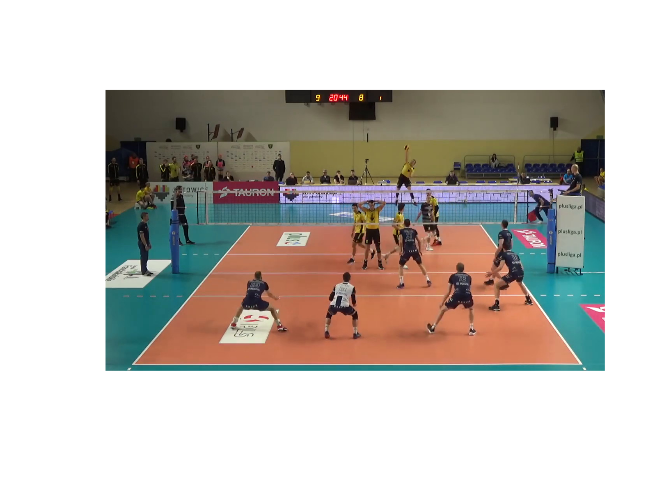
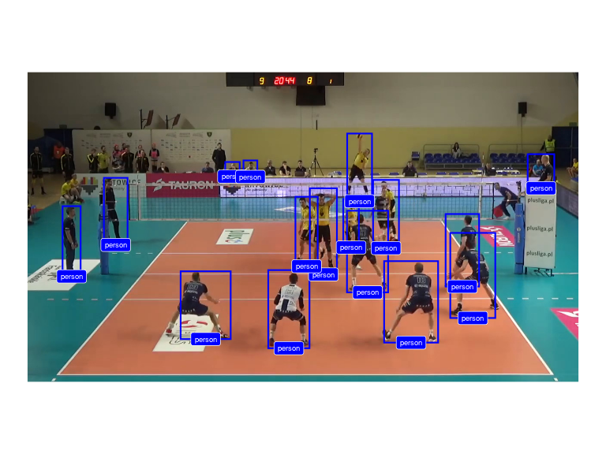
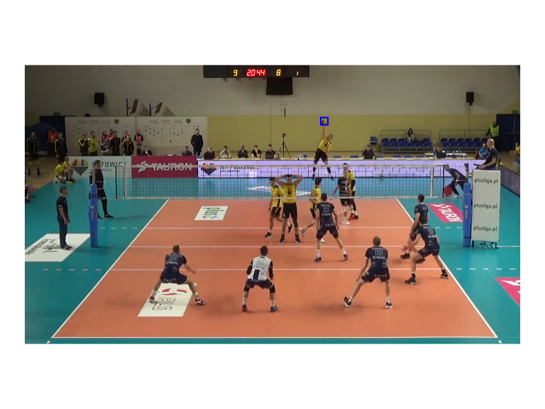
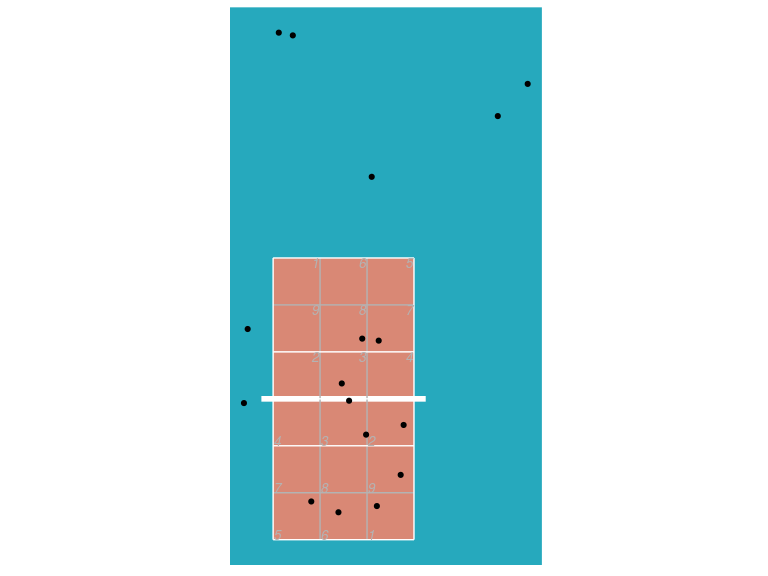

<!-- README.md is generated from README.Rmd. Please edit that file -->

# ovml

<!-- badges: start -->

[](https://www.tidyverse.org/lifecycle/#experimental)
![openvolley](https://img.shields.io/badge/openvolley-darkblue.svg?logo=data:image/svg%2bxml;base64,PHN2ZyB4bWxucz0iaHR0cDovL3d3dy53My5vcmcvMjAwMC9zdmciIHdpZHRoPSIyMTAiIGhlaWdodD0iMjEwIj48cGF0aCBkPSJNOTcuODMzIDE4Ny45OTdjLTQuNTUtLjM5Ni0xMi44MTItMS44ODYtMTMuNTgxLTIuNDQ5LS4yNDItLjE3Ny0xLjY5Mi0uNzUzLTMuMjIyLTEuMjgxLTI4LjY5Ni05Ljg5NS0zNS4xNy00NS45ODctMTMuODY4LTc3LjMyMyAyLjY3Mi0zLjkzIDIuNTc5LTQuMTktMS4zOTQtMy45MDYtMTIuNjQxLjktMjcuMiA2Ljk1Mi0zMy4wNjYgMTMuNzQ1LTUuOTg0IDYuOTI3LTcuMzI3IDE0LjUwNy00LjA1MiAyMi44NjIuNzE2IDEuODI2LS45MTgtLjE3LTEuODktMi4zMS03LjM1Mi0xNi4xNzQtOS4xODEtMzguNTYtNC4zMzctNTMuMDc0LjY5MS0yLjA3IDEuNDE1LTMuODY2IDEuNjEtMy45ODkuMTk0LS4xMjMuNzgyLTEuMDUzIDEuMzA3LTIuMDY2IDMuOTQ1LTcuNjE3IDkuNDU4LTEyLjg2MiAxNy44MzktMTYuOTcgMTIuMTcyLTUuOTY4IDI1LjU3NS01LjgyNCA0MS40My40NDUgNi4zMSAyLjQ5NSA4LjgwMiAzLjgwMSAxNi4wNDcgOC40MTMgNC4zNCAyLjc2MiA0LjIxMiAyLjg3NCAzLjU5NC0zLjE3My0yLjgyNi0yNy42ODEtMTYuOTA3LTQyLjE4NS0zNi4wNjgtMzcuMTUxLTQuMjU0IDEuMTE3IDUuMjQtMy4zMzggMTEuNjYtNS40NzMgMTMuMTgtNC4zOCAzOC45MzctNS43NzIgNDYuMDc0LTEuNDg4IDEuMjQ3LjU0NyAyLjIyOCAxLjA5NSAzLjI3NSAxLjYzIDQuMjkgMi4xMDcgMTEuNzMzIDcuNjk4IDE0LjI2NSAxMS40MjcuNDA3LjYgMS4yNyAxLjg2NiAxLjkxNyAyLjgxNCAxMS4zMDggMTYuNTY1IDguNjIzIDQxLjkxLTYuODM4IDY0LjU1Mi0zLjI0OSA0Ljc1OC0zLjI1OCA0Ljc0MiAyLjQ1IDQuMDE4IDMyLjQ4Mi00LjEyMiA0OC41MTUtMjEuOTM1IDM5LjU3OC00My45NzQtMS4xNC0yLjgwOSAxLjU2NiAxLjA2IDMuNTE4IDUuMDMyIDI5LjY5MyA2MC40MTctMjIuNTggMTA3Ljg1My03OS40OTggNzIuMTQzLTUuMDg0LTMuMTktNS4xMjMtMy4xNTItMy45MDIgMy44ODMgNC43MjEgMjcuMjIgMjUuNzgzIDQzLjU2MiA0NC4wODkgMzQuMjEgMS4zNjItLjY5NiAyLjIxLS43NSAyLjIxLS4xNDMtNi43NiAzLjg1Ny0xNi4wMTggNi41NTMtMjMuMTI2IDguMDkxLTcuNTU1IDEuNTQ3LTE4LjM2NiAyLjE3Mi0yNi4wMiAxLjUwNnoiIGZpbGw9IiNmZmYiLz48ZWxsaXBzZSBjeD0iMTA1Ljk3NSIgY3k9IjEwNC40NDEiIHJ4PSI5NC44NCIgcnk9IjkyLjU0MiIgZmlsbD0ibm9uZSIgc3Ryb2tlPSIjZmZmIiBzdHJva2Utd2lkdGg9IjEwLjc0Ii8+PC9zdmc+)
[](https://github.com/openvolley/ovml/actions)
<!-- badges: end -->

## Installation

``` r
## install.packages("remotes")
remotes::install_github("openvolley/ovml")
```

The `ovml` package provides image and video machine learning tools for
volleyball analytics. See also the
[opensportml](https://github.com/openvolley/opensportml) for a
generalized version of this package for use with other sports.

Currently three versions of the
[YOLO](https://pjreddie.com/darknet/yolo/) object detection algorithm
are included (versions 3, 4, and 7). These have been implemented on top
of the [torch](https://torch.mlverse.org/) R package, meaning that no
Python installation is required on your system.

The package also includes an experimental network specifically for
detecting volleyballs.

This implementation drew from
[ayooshkathuria/pytorch-yolo-v3](https://github.com/ayooshkathuria/pytorch-yolo-v3),
[walktree/libtorch-yolov3](https://github.com/walktree/libtorch-yolov3),
[rockyzhengwu/libtorch-yolov4](https://github.com/rockyzhengwu/libtorch-yolov4),
[gwinndr/YOLOv4-Pytorch](https://github.com/gwinndr/YOLOv4-Pytorch), and
[WongKinYiu/yolov7](https://github.com/WongKinYiu/yolov7).

## Example

Use a YOLOv4 network to recognize objects in an image. We use a video
frame image (bundled with the package):

``` r
library(ovml)
img <- ovml_example_image()
ovml_ggplot(img)
```



Construct the network. The first time this function is run, it will
download and cache the network weights file (\~250MB).

``` r
dn <- ovml_yolo()
```

Now we can use the network to detect objects in our image:

``` r
dets <- ovml_yolo_detect(dn, img, conf = 0.3)
dets <- dets[dets$class %in% c("person", "sports ball"), ]
ovml_ggplot(img, dets)
```



Note that this network didn’t detect the volleyball (in the process of
being contacted by the server). Let’s try the experimental
volleyball-specific network:

``` r
dn <- ovml_yolo("4-mvb")
ball_dets <- ovml_yolo_detect(dn, img)
ovml_ggplot(img, ball_dets, label_geom = NULL) ## don't add the label, it obscures the volleyball
```



We can transform the image detections to real-world court coordinates.
First we need to define the court reference points needed for the
transformation. We can use the `ov_shiny_court_ref` helper app for this:

``` r
library(ovideo)
ref <- ov_shiny_court_ref(img)
```

`ref` should look something like:

``` r
ref
#> $antenna
#> # A tibble: 4 × 4
#>   image_x image_y antenna where  
#>     <dbl>   <dbl> <chr>   <chr>  
#> 1   0.208   0.348 left    floor  
#> 2   0.82    0.353 right   floor  
#> 3   0.823   0.641 right   net_top
#> 4   0.2     0.643 left    net_top
#> 
#> $video_width
#> [1] 1280
#> 
#> $video_height
#> [1] 720
#> 
#> $video_framerate
#> [1] 30
#> 
#> $net_height
#> [1] 2.43
#> 
#> $court_ref
#> # A tibble: 4 × 4
#>   image_x image_y court_x court_y
#>     <dbl>   <dbl>   <dbl>   <dbl>
#> 1  0.0549  0.0221     0.5     0.5
#> 2  0.953   0.0233     3.5     0.5
#> 3  0.751   0.52       3.5     6.5
#> 4  0.289   0.516      0.5     6.5
```

Now use it with the `ov_transform_points` function (note that currently
this function expects the image coordinates to be normalized with
respect to the image width and height):

``` r
court_xy <- ovideo::ov_transform_points(x = (dets$xmin + dets$xmax) / 2 / ref$video_width,
                                        y = dets$ymin / ref$video_height,
                                        ref = ref$court_ref, direction = "to_court")
dets <- cbind(dets, court_xy)
```

And plot it:

``` r
library(datavolley)
library(ggplot2)
ggplot(dets, aes(x, y)) + ggcourt(labels = NULL, court_colour = "indoor") + geom_point()
```



Keep in mind that `ov_transform_points` is using the middle-bottom of
each bounding box and transforming it assuming that this represents a
point on the court surface (the floor). Locations associated with
truncated object boxes, or objects not on the court surface (players
jumping, people in elevated positions such as the referee’s stand) will
appear further away from the camera than they actually are.
